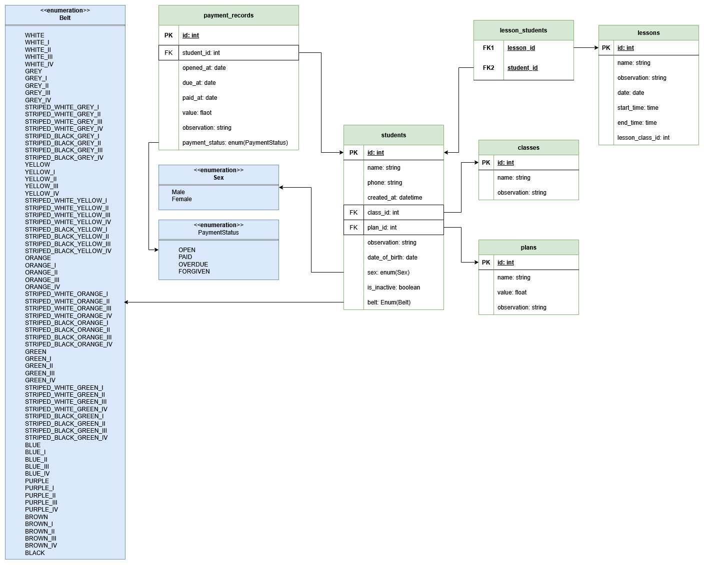

# 🥋 BJJ Admin

[Português](#português) | [English](#english)

---

## Português

### 📌 Visão Geral

Sistema de gerenciamento para academias de Jiu-Jitsu desenvolvido em Python.  
O objetivo do projeto é centralizar a gestão de alunos, turmas, planos e pagamentos, automatizando processos administrativos comuns em academias.

---

### 🧩 Funcionalidades

#### Alunos
- Cadastro de alunos  
- Atualização de dados  
- Vínculo com plano e turma  

#### Turmas
- Criação de turmas (ex: Iniciantes, Avançado, No-Gi)
- Associação de alunos  

#### Planos
- Definição de planos (mensal, trimestral, anual, etc)  
- Valor 
- Vínculo automático com pagamentos  

#### Pagamentos
- Geração automática de cobranças ao vincular aluno a um plano  
- Histórico de pagamentos  
- Status (pago, pendente, atrasado e perdoado)  

#### Aulas
- Cadastro de aulas  
- Associação com turmas  
- Controle de datas e horários  

---

### 🗂️ Modelagem do Banco de Dados

## English

### 📌 Overview

Management system for Jiu-Jitsu academies developed in Python.  
The goal of this project is to centralize the management of students, classes, plans, and payments, automating common administrative processes.

---

### 🧩 Features

#### Students
- Student registration  
- Data update  
- Link to plans and classes  

#### Classes
- Create classes (e.g. Beginners, Advanced, No-Gi)  
- Assign students  

#### Plans
- Define plans (monthly, quarterly, yearly, etc)  
- Price  
- Automatic link to payments  

#### Payments
- Automatic billing when a student is linked to a plan  
- Payment history  
- Status (paid, pending, overdue, and forgiven)  

#### Lessons
- Lesson registration  
- Link to classes  
- Date and schedule control  

---

### 🗂️ Database Modeling

